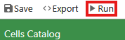
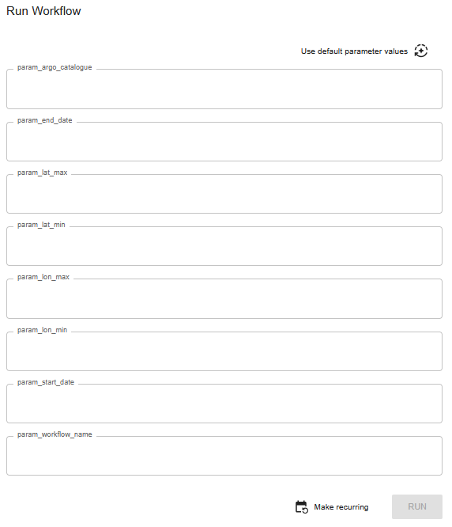
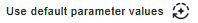
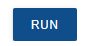
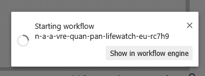
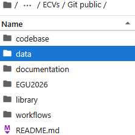
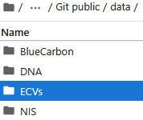
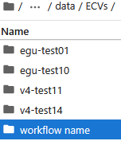
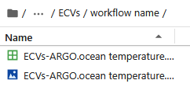

# How to run workflow

This is the instruction on how to run the workflow.

To run the workflow, you need to open the virtual lab in NaaVRE. If you are not in NaaVRE, click the link to the virtual lab (https://beta.naavre.net/vreapp/vl/ecvs) and press the `Launch my instance` button.

## Run the workflow using **parameter** input

To execute the workflow do the following:

|      | Step | Action |
| ---- | ---- | ------ |
| 1    | Open the workflow file | open [workflow](./workflows.naavrewf) |
| 2    | Start workflow         |  |
| 3    | Set parameter values   |  | 
| 3.1  | Fill in default values | 
| 3.2  | Change values          | argo_catalogue (DOXY, CHLA, ocean temperature) longitude min and max, decimal degrees latitude min and max, decimal degrees date, yyyy-mm-dd workflow name |
| 4    | Execute workflow       |  |
| 5    | Check the progress     |  |

> Option: the details of the progress can be found by pressing `Show in workflow engine` or https://staging.demo.naavre.net/argowf/workflows, login required.

## Retrieve the output data

In the `data` folder, you should see the result files from you workflow.
* jpg file: Plot of the data
* csv file: Qureied data table

You can download the file by doing right click, then pressing `download`.

| 1  | 2  | 3  | 4  |
| -- | -- | -- | -- |
|  |  |  |  |
