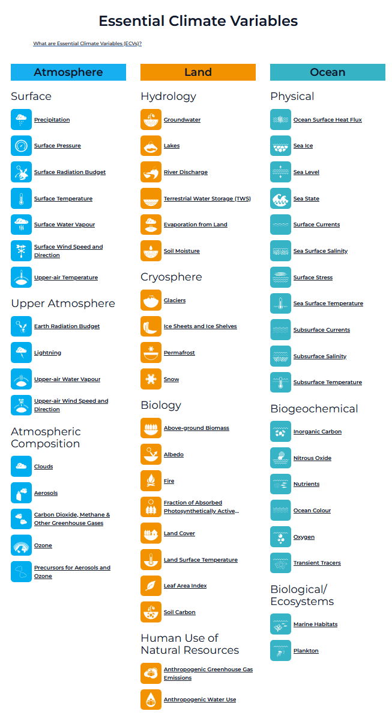
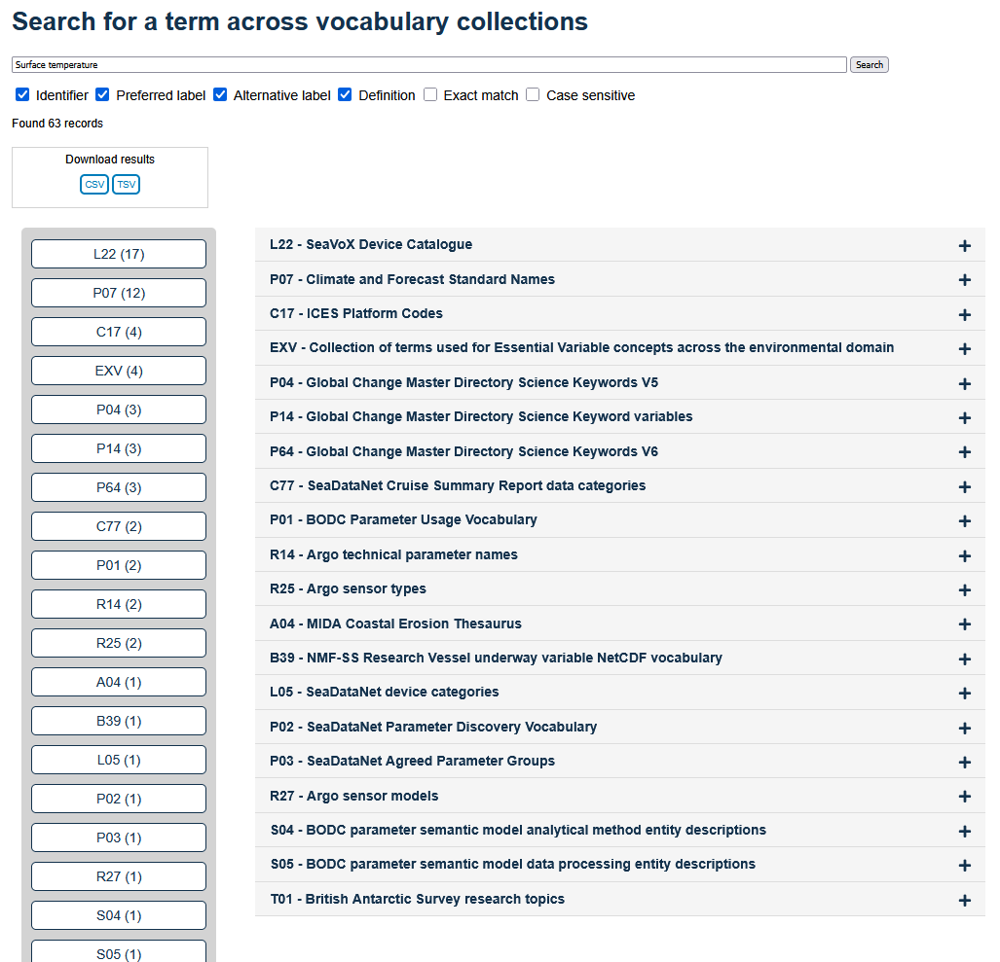

# ECV (EXV)

## About Essential Climate Variables

An Essential Climate Variable (ECV) is a physical, chemical or biological variable or a group of linked variables that critically contributes to the characterization of Earth’s climate. Global Climate Observing System ([GCOS](https://gcos.wmo.int/site/global-climate-observing-system-gcos)) currently specifies [55 ECVs](https://gcos.wmo.int/site/global-climate-observing-system-gcos/essential-climate-variables).

ECV datasets provide the empirical evidence needed to understand and predict the evolution of climate, to guide mitigation and adaptation measures, to assess risks and enable attribution of climate events to underlying causes, and to underpin climate services. They are required to support the work of the UNFCCC and the IPCC.

### ECV are identified based on the following criteria:

* Relevance: The variable is critical for characterizing the climate system and its changes.
* Feasibility: Observing or deriving the variable on a global scale is technically feasible using proven, scientifically understood methods.
* Cost effectiveness: Generating and archiving data on the variable is affordable, mainly relying on coordinated observing systems using proven technology, taking advantage where possible of historical datasets.

### ECV Observation Requirements

Current ECV requirements according to the 2022 GCOS ECV Requirements ([GCOS-245](https://library.wmo.int/records/item/58111-the-2022-gcos-ecvs-requirements)):

* Atmosphere
* Ocean
* Land

## ENVRI-HUB, [website](https://envrihub.vm.fedcloud.eu/)

Data Portal of the European Environmental Research Infrastructures

The variables can be found in **[variable list](documentation/BeaconAPI-variable_list.csv)**.

### Research Infrastructures

* ACTRIS, Aerosol, Clouds, and Trace Gases Research Infrastructure
* ARGO, Real-time global ocean in situ observing system
* CDI, SeaDataNet Common Data Index (CDI) service
* IAGOS, In-service Aircraft for a Global Observing System
* ICOS, Integrated Carbon Observation System
* IRISCC, Integrated Research Infrastructure Services for Climate Change Risks

Supported tables in each research infrastructure.

| ACTRIS         | ARGO      | CDI     | IAGOS    | ICOS    | IRISCC     |
| -------------- | --------- | ------- | -------- | ------- | ---------- |
| default        | default   | default | default  | default | default    |
| actris         | argo      |         | iagos-l1 |         | iriscc-no2 |
| actris-in-situ | argo_bgc  |         | iagos-l2 |         | iriscc-p10 |
| actris-nrt     | argo_core |         |          |         |            |

## Natural Environment Research Council [(NERC)](https://www.ukri.org/councils/nerc/)

NERC is the driving force of investment in environmental science.

### ESV list [(EXV)](http://vocab.nerc.ac.uk/collection/EXV/current/)

| ID | Preferred Label |
| -- | --------------- |
| [EXV049](https://gcos.wmo.int/en/essential-climate-variables/biomass) | Above-ground biomass |
| [EXV016](https://gcos.wmo.int/en/essential-climate-variables/aerosols) | Aerosol properties |
| [EXV047](https://gcos.wmo.int/en/essential-climate-variables/albedo) | Albedo |
| [EXV053](https://gcos.wmo.int/en/essential-climate-variables/ghg-fluxes) | Anthropogenic greenhouse gas fluxes |
| [EXV055](https://gcos.wmo.int/en/essential-climate-variables/water-use) | Anthropogenic water use |
| [EXV068](https://goosocean.org/document/36269) | Benthic invertebrate abundance and distribution |
| [EXV013](https://gcos.wmo.int/en/essential-climate-variables/ghg) | Carbon dioxide, methane and other greenhouse gases |
| [EXV011](https://gcos.wmo.int/en/essential-climate-variables/clouds) | Cloud properties |
| [EXV063](https://goosocean.org/document/17512) | Coral cover and composition |
| [EXV010](https://gcos.wmo.int/en/essential-climate-variables/earth-radiation) | Earth radiation budget |
| [EXV054](https://gcos.wmo.int/en/essential-climate-variables/evaporation) | Evaporation from land |
| [EXV052](https://gcos.wmo.int/en/essential-climate-variables/fire) | Fire |
| [EXV059](https://goosocean.org/document/17510) | Fish abundance and distribution |
| [EXV045](https://gcos.wmo.int/en/essential-climate-variables/fapar) | Fraction of absorbed PAR |
| [EXV042](https://gcos.wmo.int/en/essential-climate-variables/glaciers) | Glaciers |
| [EXV036](https://gcos.wmo.int/en/essential-climate-variables/groundwater) | Groundwater |
| [EXV043](https://gcos.wmo.int/en/essential-climate-variables/ice-sheets-ice-shelves) | Ice sheets ad ice shelves |
| [EXV037](https://gcos.wmo.int/en/essential-climate-variables/lakes) | Lakes |
| [EXV050](https://gcos.wmo.int/en/essential-climate-variables/land-cover) | Land cover |
| [EXV048](https://gcos.wmo.int/en/essential-climate-variables/land-temperature) | Land-surface temperature |
| [EXV046](https://gcos.wmo.int/en/essential-climate-variables/lai) | Leaf area index |
| [EXV012](https://gcos.wmo.int/en/essential-climate-variables/lightning) | Lightning |
| [EXV065](https://goosocean.org/document/17515) | Macroalgal canopy cover and composition |
| [EXV066](https://goosocean.org/document/17514) | Mangrove cover and composition |
| [EXV035](https://gcos.wmo.int/en/essential-climate-variables/marine-habitats/) | Marine habitat properties |
| [EXV062](https://goosocean.org/document/36266) | Marine mammal abundance and distribution |
| [EXV067](https://goosocean.org/document/36264) | Microbe biomass and diversity |
| [EXV029](https://goosocean.org/document/17474) | Nutrients |
| [EXV058](https://goosocean.org/document/32488) | Ocean bottom pressure |
| [EXV033](https://goosocean.org/document/19959) | Ocean colour |
| [EXV030](https://goosocean.org/document/17475) | Ocean inorganic carbon |
| [EXV032](https://goosocean.org/document/17478) | Ocean nitrous oxide |
| [EXV069](https://goosocean.org/document/22567) | Ocean sound |
| [EXV026](https://goosocean.org/document/17472) | Ocean surface heat flux |
| [EXV025](https://goosocean.org/document/17463) | Ocean surface stress |
| [EXV028](https://goosocean.org/document/17473) | Oxygen |
| [EXV014](https://gcos.wmo.int/en/essential-climate-variables/ozone) | Ozone |
| [EXV044](https://gcos.wmo.int/en/essential-climate-variables/permafrost) | Permafrost |
| [EXV056](https://goosocean.org/document/17507) | Phytoplankton biomass and diversity |
| [EXV034](https://gcos.wmo.int/en/essential-climate-variables/plankton/) | Plankton |
| [EXV005](https://gcos.wmo.int/en/essential-climate-variables/precipitation) | Precipitation |
| [EXV015](https://gcos.wmo.int/en/essential-climate-variables/precursors) | Precursors (supporting the aerosol and ozone ECVs) |
| [EXV038](https://gcos.wmo.int/en/essential-climate-variables/rivers) | River discharge |
| [EXV027](https://goosocean.org/document/17464) | Sea ice |
| [EXV023](https://goosocean.org/document/17465) | Sea level |
| [EXV024](https://goosocean.org/document/17462) | Sea state |
| [EXV060](https://goosocean.org/document/36268) | Sea turtles abundance and distribution |
| [EXV019](https://goosocean.org/document/17470) | Sea-surface salinity |
| [EXV017](https://goosocean.org/document/17466) | Sea-surface temperature |
| [EXV061](https://goosocean.org/document/36267) | Seabirds abundance and distribution |
| [EXV064](https://goosocean.org/document/17513) | Seagrass cover and composition |
| [EXV041](https://gcos.wmo.int/en/essential-climate-variables/snow) | Snow |
| [EXV051](https://gcos.wmo.int/en/essential-climate-variables/soil-carbon) | Soil carbon |
| [EXV039](https://gcos.wmo.int/en/essential-climate-variables/soil-moisture) | Soil moisture |
| [EXV022](https://goosocean.org/document/17469) | Subsurface currents |
| [EXV020](https://goosocean.org/document/17471) | Subsurface salinity |
| [EXV018](https://goosocean.org/document/17467) | Subsurface temperature |
| [EXV021](https://goosocean.org/document/17468) | Surface currents |
| [EXV001](https://gcos.wmo.int/en/essential-climate-variables/pressure) | Surface pressure |
| [EXV006](https://gcos.wmo.int/en/essential-climate-variables/surface-radiation) | Surface Radiation Budget |
| [EXV002](https://gcos.wmo.int/en/essential-climate-variables/surface-temperature) | Surface temperature |
| [EXV004](https://gcos.wmo.int/en/essential-climate-variables/surface-vapour) | Surface water vapour |
| [EXV003](https://gcos.wmo.int/en/essential-climate-variables/surface-wind) | Surface wind speed and direction |
| [EXV040](https://gcos.wmo.int/en/essential-climate-variables/tws/) | Terrestrial water storage |
| [EXV031](https://goosocean.org/document/17476) | Transient tracers |
| [EXV007](https://gcos.wmo.int/en/essential-climate-variables/upper-temperature) | Upper-air Temperature |
| [EXV009](https://gcos.wmo.int/en/essential-climate-variables/upper-vapour) | Upper-air water vapour |
| [EXV008](https://gcos.wmo.int/en/essential-climate-variables/upper-wind) | Upper-air wind speed and direction |
| [EXV057](https://goosocean.org/document/17509) | Zooplankton biomass and diversity |

### InteroperAble Descriptions of Observable Property Terminology [(I-ADPOT)](https://i-adopt.github.io/)

* [Framework](https://github.com/i-adopt/framework/)
* [Framework ontology](https://i-adopt.github.io/ontology/)
* [User Stories](https://github.com/i-adopt/users_stories/)
* [Visualizer](https://sirkos.github.io/iadopt-vis/)
* [Examples](https://github.com/mabablue/I-ADOPT-examples-playground/)

### Example vocabulary

#### [EXV002](https://vocab.nerc.ac.uk/collection/EXV/current/EXV002/) (Surface temperature) in [P02](https://vocab.nerc.ac.uk/collection/P02/current/) (SeaDataNet Parameter Discovery Vocabulary) and [P07](https://vocab.nerc.ac.uk/collection/P07/current/) (Climate and Forecast Standard Names)

The mapping table on NERC, https://vocab.nerc.ac.uk/search_nvs/cmap/?a=P02&b=P07

| P02 Identifier | P02 Preferred label | P07 Identifier | P07 Preferred label | Mapping URL | Status |
| -------------- | ------------------- | -------------- | ------------------- | ----------- | ------ |
| SDN:P02::TEMP  | Temperature of the water column      | SDN:P07::CFSN0381 | sea_surface_temperature         | [32201](http://vocab.nerc.ac.uk/mapping/I/32201/)   | accepted |
| SDN:P02::TEMP  | Temperature of the water column      | SDN:P07::CFSN0335 | sea_water_temperature           | [32203](http://vocab.nerc.ac.uk/mapping/I/32203/)   | accepted |
| SDN:P02::PSST  | Skin temperature of the water column | SDN:P07::CFV9N3   | sea_surface_subskin_temperature | [154843](http://vocab.nerc.ac.uk/mapping/I/154843/) | accepted |

## TODO

* Fix, linking NERC vocabulary service, EXV -> variable name
* Add select table columns option
* Add status of component execution, store the output file list
* 
