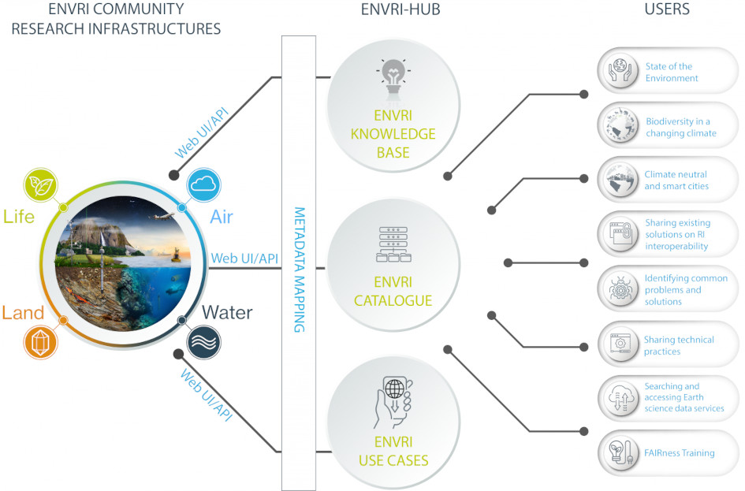

# Essential Climate Variables (ECVs) Virtual Lab (VLab)

**The primary objective of the ECVs VLab is to offer reusable components that enable users to support research activities, access ECVs, and develop domain-specific workflows.**

The concept behind ECVs VLab originates from the [ENVRI-Hub](https://envrihub.vm.fedcloud.eu/) project, which serves as a central gateway to environmental data and services provided by European environmental research infrastructures. The hub delivers interoperable data across Earth system disciplines, making it readily accessible and easy to use for interdisciplinary environmental research.

## About ECVs

An Essential Climate Variable (ECV) is a physical, chemical or biological variable or a group of linked variables that critically contributes to the characterization of Earth’s climate. Global Climate Observing System ([GCOS](https://gcos.wmo.int/site/global-climate-observing-system-gcos)) currently specifies [55 ECVs](https://gcos.wmo.int/site/global-climate-observing-system-gcos/essential-climate-variables). Current ECV requirements according to the 2022 GCOS ECV Requirements ([GCOS-245](https://library.wmo.int/records/item/58111-the-2022-gcos-ecvs-requirements)).

ECV datasets provide the empirical evidence needed to understand and predict the evolution of climate, to guide mitigation and adaptation measures, to assess risks and enable attribution of climate events to underlying causes, and to underpin climate services. They are required to support the work of the UNFCCC and the IPCC.

### Research Infrastructures

* [ACTRIS](https://www.actris.eu/), Aerosol, Clouds, and Trace Gases Research Infrastructure
* [ARGO](https://www.euro-argo.eu/), Real-time global ocean in situ observing system
* [CDI](https://www.seadatanet.org/Metadata/CDI-Common-Data-Index), SeaDataNet Common Data Index (CDI) service
* [IAGOS](https://www.iagos.org/), In-service Aircraft for a Global Observing System
* [ICOS](https://www.icos-cp.eu/), Integrated Carbon Observation System
* [IRISCC](https://www.iriscc.eu/), Integrated Research Infrastructure Services for Climate Change Risks

The tables in each research infrastructure, available through Beacon (Maris) [nodes](https://maris-development.github.io/beacon/available-nodes/available-nodes.html).

| ACTRIS         | ARGO      | CDI     | IAGOS    | ICOS    | IRISCC     |
| -------------- | --------- | ------- | -------- | ------- | ---------- |
| default        | default   | default | default  | default | default    |
| actris         | argo      |         | iagos-l1 |         | iriscc-no2 |
| actris-in-situ | argo_bgc  |         | iagos-l2 |         | iriscc-p10 |
| actris-nrt     | argo_core |         |          |         |            |

## Natural Environment Research Council [(NERC)](https://www.ukri.org/councils/nerc/)

NERC is the driving force of investment in environmental science.
The NERC Vocabulary Server [(NVS)](https://vocab.nerc.ac.uk/) is a service providing access to centrally managed and uniquely identified lists of terms for annotating data in the marine and related earth science domains.
In the NVS, each vocabulary is a SKOS collection (e.g. https://vocab.nerc.ac.uk/collection/L22/current/) that has many terms that are SKOS concepts (e.g. https://vocab.nerc.ac.uk/collection/L22/current/TOOL1248/).

### NERC Tools

#### Querying vocabulary

Several tools for querying existing vocabulary collections:

* NVS Vocab Search: Searches entire NVS content (options to search for terms in a given collection, in any collection, search for entire collections, or explore mappings)
* SeaDataNet Search: Focuses on collections used by SeaDataNet
* SDN Facet search: Searches P01 codes with filters
* SDN parameter discovery: Displays relationships among collections
* NVS Feed: Provides updates on concept collections
* NVS LDES Feed: Publishes latest concept changes in Turtle format. Concept updates will typically be accessible post 11:00 AM GMT. There is one feed per collection and can be accessed using the following url structure 

#### InteroperAble Descriptions of Observable Property Terminology [(I-ADPOT)](https://i-adopt.github.io/)

I-ADPOT is a Research Data Alliance initiative that developed a framework to harmonize how scientific variable descriptions (observable properties) are structured. The framework enables machine-readable data, enhancing semantic interoperability by decomposing variable names into components like Matrix, Object of Interest, and Property.

Key aspects of the I-ADOPT Working Group and its outputs:

* Purpose: To tackle the lack of interoperability between different terminology sources describing observational data (e.g., in Earth, marine, and environmental sciences).
* Framework Structure: The I-ADOPT Framework uses a semantic structure to define what was measured, computed, or observed, ensuring machine-readability.
* Terminology Mapping: It supports the NERC Vocabulary Server (NVS) in mapping local data to standard vocabularies.
* Key Components: The framework includes components such as Variable, Entity (ObjectOfInterest, Matrix), Property, and Constraint.
* Adoption: The recommendations from the group were endorsed by the RDA in 2022 and focus on FAIR (Findable, Accessible, Interoperable, Reusable) principles.

The following resources are useful to better understand I-ADOPT:

* [Framework](https://github.com/i-adopt/framework/)
* [Framework ontology](https://i-adopt.github.io/ontology/)
* [User Stories](https://github.com/i-adopt/users_stories/)
* [Visualizer](https://sirkos.github.io/iadopt-vis/)
* [Examples](https://github.com/mabablue/I-ADOPT-examples-playground/)

### ECVs in NERC [(EXV)](http://vocab.nerc.ac.uk/collection/EXV/current/)

| ID     | Atmosphere                                         | ID     | Land                                | ID     | Ocean                     |
| ------ | -------------------------------------------------- | ------ | ----------------------------------- | ------ | ------------------------- |
|        | **Surface**                                        |        | **Hydrology**                       |        | **Physical**              |
| EXV005 | Precipitation                                      | EXV036 | Groundwater                         | EXV026 | Ocean surface heat flux   |
| EXV001 | Surface pressure                                   | EXV037 | Lakes                               | EXV027 | Sea ice                   |
| EXV006 | Surface Radiation Budget                           | EXV038 | River discharge                     | EXV023 | Sea level                 |
| EXV002 | Surface temperature                                | EXV040 | Terrestrial water storage           | EXV024 | Sea state                 |
| EXV004 | Surface water vapour                               | EXV054 | Evaporation from land               | EXV021 | Surface currents          |
| EXV003 | Surface wind speed and direction                   | EXV039 | Soil moisture                       | EXV019 | Sea-surface salinity      |
| EXV007 | Upper-air Temperature                              |        | **Cryosphere**                      | EXV025 | Ocean surface stress      |
|        | **Upper Atmosphere**                               | EXV042 | Glaciers                            | EXV017 | Sea-surface temperature   |
| EXV010 | Earth radiation budget                             | EXV043 | Ice sheets ad ice shelves           | EXV022 | Subsurface currents       |
| EXV012 | Lightning                                          | EXV044 | Permafrost                          | EXV020 | Subsurface salinity       |
| EXV009 | Upper-air water vapour                             | EXV041 | Snow                                | EXV018 | Subsurface temperature    |
| EXV008 | Upper-air wind speed and direction                 |        | **Biology**                         |        | **Biogeochemical**        |
|        | **Atmospheric Composition**                        | EXV049 | Above-ground biomass                | EXV030 | Ocean inorganic carbon    |
| EXV011 | Cloud properties                                   | EXV047 | Albedo                              | EXV032 | Ocean nitrous oxide       |
| EXV016 | Aerosol properties                                 | EXV052 | Fire                                | EXV029 | Nutrients                 |
| EXV013 | Carbon dioxide, methane and other greenhouse gases | EXV045 | Fraction of absorbed PAR            | EXV033 | Ocean colour              |
| EXV014 | Ozone                                              | EXV050 | Land cover                          | EXV028 | Oxygen                    |
| EXV015 | Precursors (supporting the aerosol and ozone ECVs) | EXV048 | Land-surface temperature            | EXV031 | Transient tracers         |
|        |                                                    | EXV046 | Leaf area index                     |        | **Biological/Ecosystems** |
|        |                                                    | EXV051 | Soil carbon                         | EXV035 | Marine habitat properties |
|        |                                                    |        | **Human Use of Natural Resources**  | _EXV066_ | _Mangrove cover and composition_          |
|        |                                                    | EXV053 | Anthropogenic greenhouse gas fluxes | _EXV064_ | _Seagrass cover and composition_          |
|        |                                                    | EXV055 | Anthropogenic water use             | _EXV065_ | _Macroalgal canopy cover and composition_ |
|        |                                                    |        |                                     | _EXV063_ | _Coral cover and composition_             |
|        |                                                    |        |                                     | EXV034 | Plankton                  |
|        |                                                    |        |                                     | _EXV056_ | _Phytoplankton biomass and diversity_ |
|        |                                                    |        |                                     | _EXV057_ | _Zooplankton biomass and diversity_   |

### Some EOVs in NERC [(EXV)](http://vocab.nerc.ac.uk/collection/EXV/current/)

Essential Ocean Variables, [GOOS Ocean](https://goosocean.org/what-we-do/framework/essential-ocean-variables/)

| ID                                             | Label                                           |
| ---------------------------------------------- | ----------------------------------------------- |
| [EXV058](https://goosocean.org/document/32488) | Ocean bottom pressure                           |
| [EXV059](https://goosocean.org/document/17510) | Fish abundance and distribution                 |
| [EXV060](https://goosocean.org/document/36268) | Sea turtles abundance and distribution          |
| [EXV061](https://goosocean.org/document/36267) | Seabirds abundance and distribution             |
| [EXV062](https://goosocean.org/document/36266) | Marine mammal abundance and distribution        |
| [EXV067](https://goosocean.org/document/36264) | Microbe biomass and diversity                   |
| [EXV068](https://goosocean.org/document/36269) | Benthic invertebrate abundance and distribution |
| [EXV069](https://goosocean.org/document/22567) | Ocean sound                                     |

### Example querying vocabulary in NVS

#### [EXV002](https://vocab.nerc.ac.uk/collection/EXV/current/EXV002/) (Surface temperature) in [P02](https://vocab.nerc.ac.uk/collection/P02/current/) (SeaDataNet Parameter Discovery Vocabulary) and [P07](https://vocab.nerc.ac.uk/collection/P07/current/) (Climate and Forecast Standard Names)

The combine mapping table, https://vocab.nerc.ac.uk/search_nvs/cmap/?a=P02&b=P07

| P02 Identifier | P02 Preferred label | P07 Identifier | P07 Preferred label | Mapping URL | Status |
| -------------- | ------------------- | -------------- | ------------------- | ----------- | ------ |
| SDN:P02::TEMP  | Temperature of the water column      | SDN:P07::CFSN0381 | sea_surface_temperature         | [32201](http://vocab.nerc.ac.uk/mapping/I/32201/)   | accepted |
| SDN:P02::TEMP  | Temperature of the water column      | SDN:P07::CFSN0335 | sea_water_temperature           | [32203](http://vocab.nerc.ac.uk/mapping/I/32203/)   | accepted |
| SDN:P02::PSST  | Skin temperature of the water column | SDN:P07::CFV9N3   | sea_surface_subskin_temperature | [154843](http://vocab.nerc.ac.uk/mapping/I/154843/) | accepted |

## TODO

* Fix, linking NERC vocabulary service, EXV -> variable name
* Add select table columns option
* Add status of component execution, store the output file list
* 
